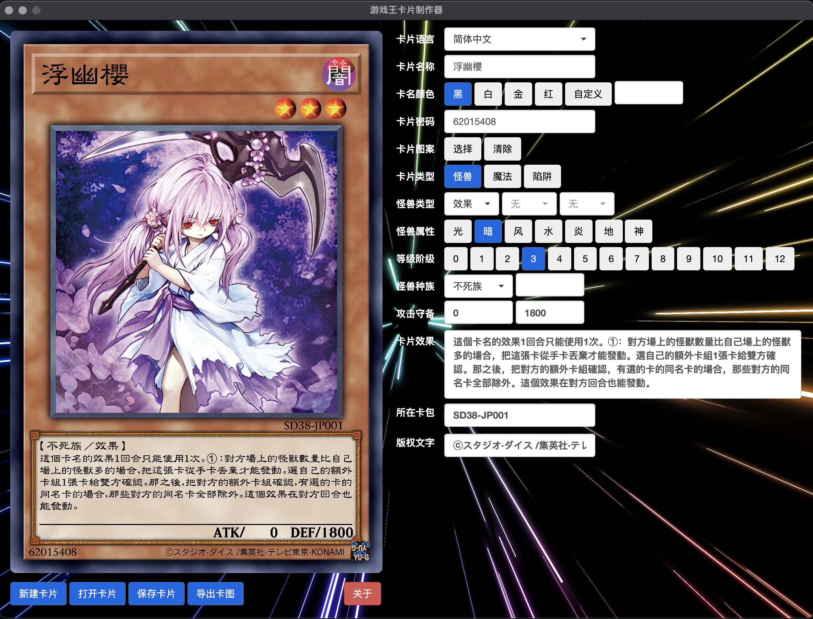

# 游戏王卡片制作器[Electron版]

一款跨平台的卡片制作器，采用 Electron 制作。

相较于之前写的制卡器，Electron 版效率非常高，采用了 Yami 大佬编写的 ```card.js``` 来完成核心的渲染（部分代码有改）。

在使用本制卡器前，首先要确保安装了 GraphicsMagick，这个库用来完成对图像的剪裁等操作，具体的安装方法在程序内有。

- - -

编译方法:

```shell
$ git clone https://github.com/rarnu/electron-diy.git
$ cd electron-diy
$ npm install
$ electron-builder -w  # 编译 windows 版本
$ electron-builder -m  # 编译 mac 版本
$ electron-builder -l  # 编译 linux 版本
```

- - -

CHANGELOG:

**1.0.1**

1. 修复了语言切换时卡图渲染不会变化的问题
2. 增加了不同语言下显示怪兽种族文字的问题
3. 修复了从卡片类型从魔法、陷阱切换回怪兽时，出现背景出问题
4. 修复了魔法、陷阱界面按钮文字不显示的问题
5. 修复 card.js 中灵摆刻度位置靠左的问题
6. 修复 card.js 中日语注音文字有误的问题

- - -

软件截图:




